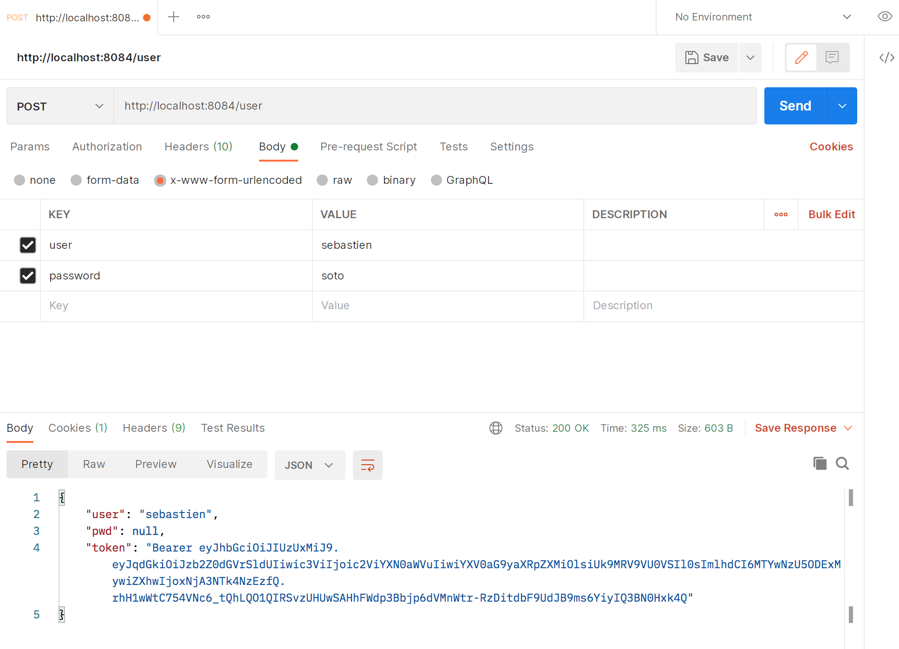
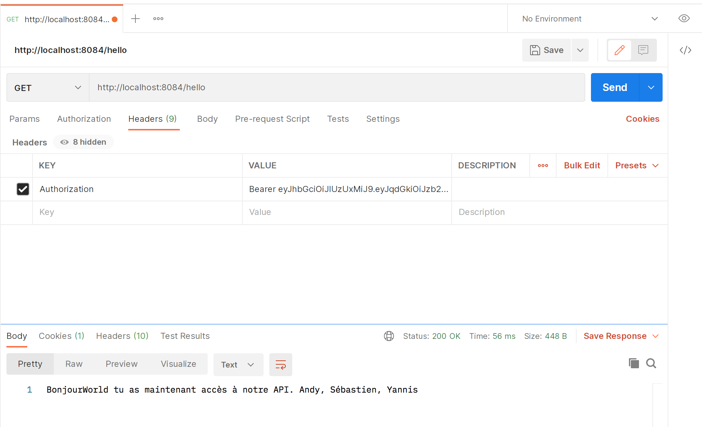
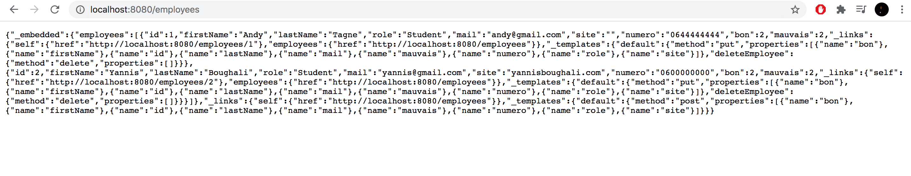
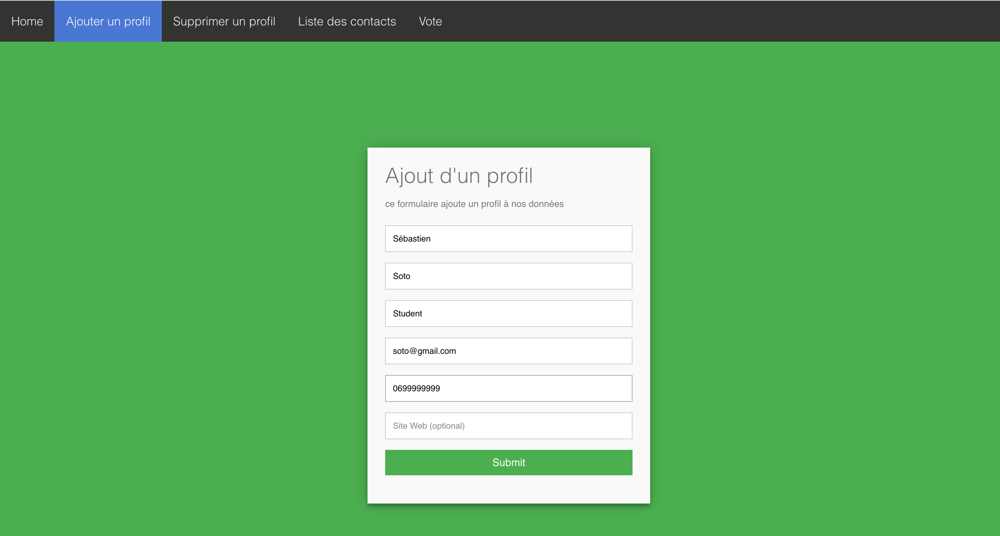
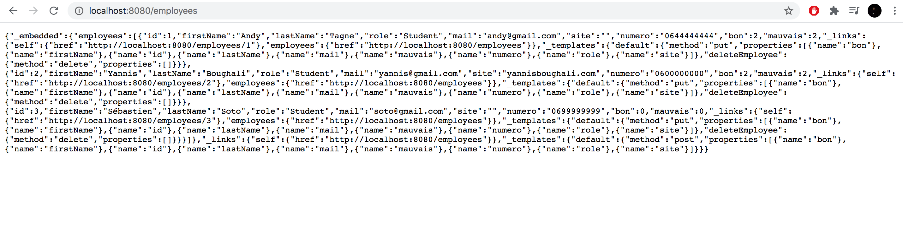
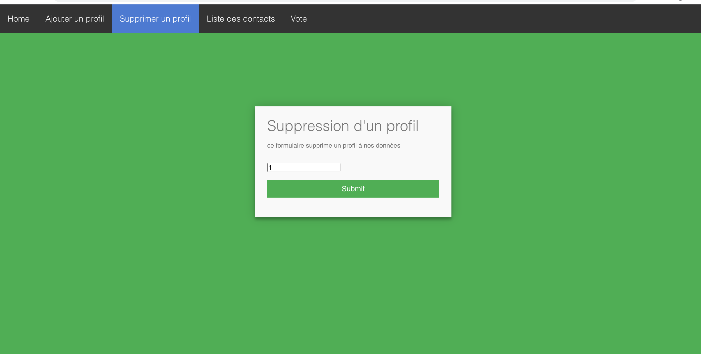
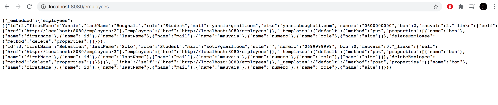
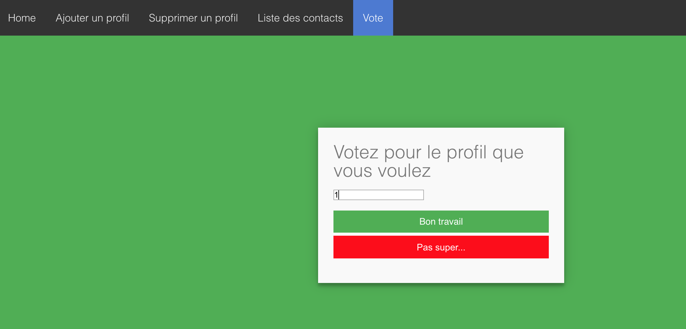
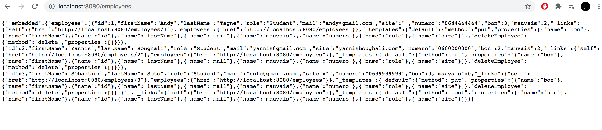

# Programmation Web orienté mobile

Un site faisant office d'annuaire regroupant différent employés d'une societé.

----------------

## Sur certaines APIs, nous avons eu des soucis avec le CORS Policy sur le navigateur, nous vous conseillons donc monsieur de tester nos APIs sur le site https://www.postman.com/.

-----------------
## Ce que nous avons réussi à faire:
   ### API 1: http://localhost:8081/hello et http://localhost:8081/user
   Nous avons réussi à faire un login mot de passe avec un token( de 10 minutes), nous nous sommes servis de la base Hibernate que vous nous avez donnée.
   ### API 2: http://localhost:8080/employees
   Nous avons pratiquement tout réussi dans cet API
   ### API 3: http://localhost:8082/votes
   Nous avons fait une API qui permet à un utilisateur de voter.
   ### Front:
   Nous avons fait un bon front
   
------------------

## Ce que nous n'avons pas réussi à faire:
Nous avions certains problèmes avec les versions de nos SDKs et JDKs, ce qui créait souvent des conflits dans l'IDE et découlait à des erreurs
   ### API 1:
   On arrivait pas à interargir avec la base Hibernate pour procéder à l'authentification d'un utilisateur.
   Un token plus sécurisé ( nous n'avions pas assez de compétences techniques pour l'améliorer)
   ### API 3:
   Pour cet API nous voulions faire un vote procéder à un vote unique par jour mais nous ne sommes pas arrivés à mettre en place cette solution
   ### Front:
   Nous aurions pu faire un meilleur front avec des boutons de recherche
   
-----------------
   
## Ce que nous avons appris:

| Nouvelles compétences techniques       | Amélioration de ces compétences techniques      | Compétence humaine |
| ------|-----|-----|
| Coder en JQuery, comprendre les différentes requetes possibles à une api  	| HTML/CSS,  	| Réflechir à une solution en groupe 	|
| Appliquer les différentes requetes possibles à une api (seulement de la théorie en cours) 	| Coder en java  	| S'organiser, se répartir le travail et aider les autres en faisant des transferts de compétences selon le niveau de chacun dans les domaines 	|
| Comprendre, utiliser et rédiger un script Maven  	| L'utilisation de GitHub (une première en groupe)  	| Communication entre nous pour coordonner nos actions 	|
| Comprendre la structure d'un projet java et gérer les problèmes liées au JDK et dépendances  	| Trouver et traiter des informations perminantes sur internet pour se débloquer  	| Se documenter 	|

----------------
## Membre de l'équipe 

- Andy Tagne
- Sébastien Soto
- Yannis Boughali
----------------
## Stack technique
----------------
### Front-end : HTML/CSS/Jquery
----------------
### Back-end : Java

Storage : Base de donné Hibernate

----------------
## NB : 

Notre méthodologie de travail tout au long du projet était la suivante : deux personnes s’occupaient essentiellement des APIs avec une troisième personne en support en cas d’aide et cette dernière s’occupait essentiellement du Front. Certaines erreurs principalement dûes à des versions java pas compatibles ou à des erreurs avec Maven faisaient en sorte que pour certains projets, il n’y ait qu’une seule personne qui puisse travailler ; dans ce sens cette dernière faisait un partage d’écran avec les autres en support dans le cas où il commet des erreurs ou nécessite de se documenter.

---------------
## API 1 : Login

### Context:
Notre objet User n’est constitué que d’un nom et d’un mot de passe.

Sur ce premier projet nous avons pour une première partie parfaitement réussie le login d’un utilisateur avec la création d’un token ; lorsqu’on a décidé d’améliorer notre projet en y intégrant l’authentification, nous avons eu des soucis avec notre Maven et malgré nos recherches intensives, bous n’avons pas pu découvrir d’où provenait l’erreur.

Vous pouvez voir ci-dessous des captures d’écran du fonctionnement de notre API sur le site POSTMAN.

| 1) GET Sécurité par le token|
|     :---:    |
||

1) Il est impossible de faire un GET sur 127.0.0.1:8080/hello, l'accès est sécurisé par un tocken.

*Dispositif électronique que l'on transporte avec soi et qui sert à produire des codes ou des mots de passe à partir desquels l'appareil qui les reçoit peut reconnaître l'identité de la personne qui désire obtenir l'accès à un réseau, à un système ou à un ordinateur.*

| 2) POST login password|
|     :---:    |
||

2) POST sur 127.0.0.1:8080/user si le user password est bon alors alors le tocken renvoi sur clé secret. Le tocken à un temps limité de 10 minutes.

| 3) Accès autoriser à l'api|
|     :---:     |
||

3) GET sur 127.0.0.1:8080/hello possible grace à la clé secrete obtenu par le tocken seul les users autorisés on accès à cette api.

## API 2 : Gestion des utilisateurs

### NB:

Le projet avait pour but de créer des sondages, les supprimer et des les lister, avec votre permission vous nous avez accordés la possibilité de modifier ce projet dans la forme mais de garder l’idée de l’API. En ce sens vu qu’un membre de notre groupe avait un projet d’entreprenariat lié à la gestion d’entreprise, nous avons choisi de faire une API qui crée des employés, les supprime et les liste.

127.0.0.1:8080/employees: GET l'api renvoie les objets employee stocker dans la class database

127.0.0.1:8080/employees/<int:id>: GET l'api renvoi l'objets employee dont l'ID correspond si l'api est vide alors message d'erreur

127.0.0.1:8080/employees: POST création d'un objets employee ajouter à l'api

127.0.0.1:8080/employees/<int:id>: PUT modifie l'objets employee dont l'ID correspond

### Context:
C’est l’API que nous avons le mieux réussi car nous avions une bonne ligne directrice.
Nous n’avons pas eu d’erreurs particulières lorsque nous élaborions cet API.

Vous pouvez voir ci-dessus des captures d’écran du fonctionnement de notre API.

### Liste employés

| 1-a) GET sur employee|
|     :---:    |
||

| 1-b) Affichage Front|
|     :---:    |
||

### Ajout employé

| 2-a) POST sur employee|
|     :---:    |
||

| 2-b) Affichage Json, nouvel employé|
|     :---:    |
||

### Suppression employé

| 3-a) DELETE sur employee|
|     :---:    |
||

| 3-b) Affichage Json, employé supprimé|
|     :---:    |
||

127.0.0.1:8080/employees : G elle reçois un login et un mots de passe et renvoie un token d'authentification qui pourra être utilisé pour identifier l'utilisateur sur les autres API

## End point
------------------

### API 3 : Gestion des sondages 

### NB:

Ici, toujours avec votre permission nous avons décidé de faire une API qui permet de voter pour un employé, lui attribuant ainsi une note en fonction de son travail. Ceci est une continuité de l’API 2 et toujours liée à ce projet d’entreprenariat.

### Problème rencontré:

A la fin de cet API nous avons eu quelques soucis avec le front ; en ce sens le navigateur avait du mal à accepter la requête et nous avions un problème de CORS policy, après de multiples recherches, nous avons réussi à résoudre ce problème.
Nous vous conseillons donc ainsi de tester toutes les API sur le site POSTMAN

Vous pouvez voir ci-dessous la captures d’écran du fonctionnement de notre API. 

### Captures d'écran

| a) Vote sur employee|
|     :---:    |
||

| b) Affichage Front|
|     :---:    |
||

